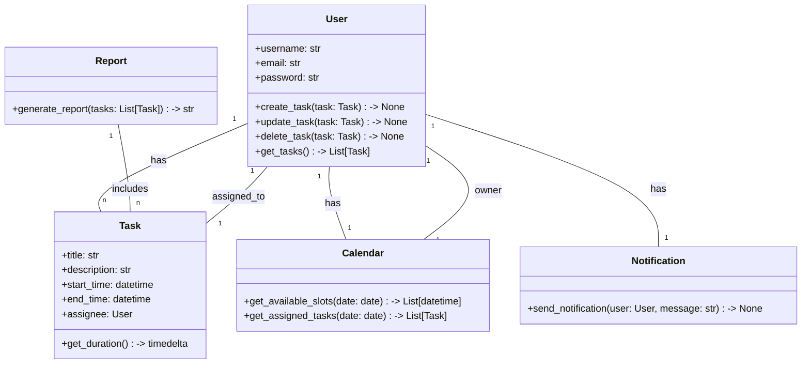
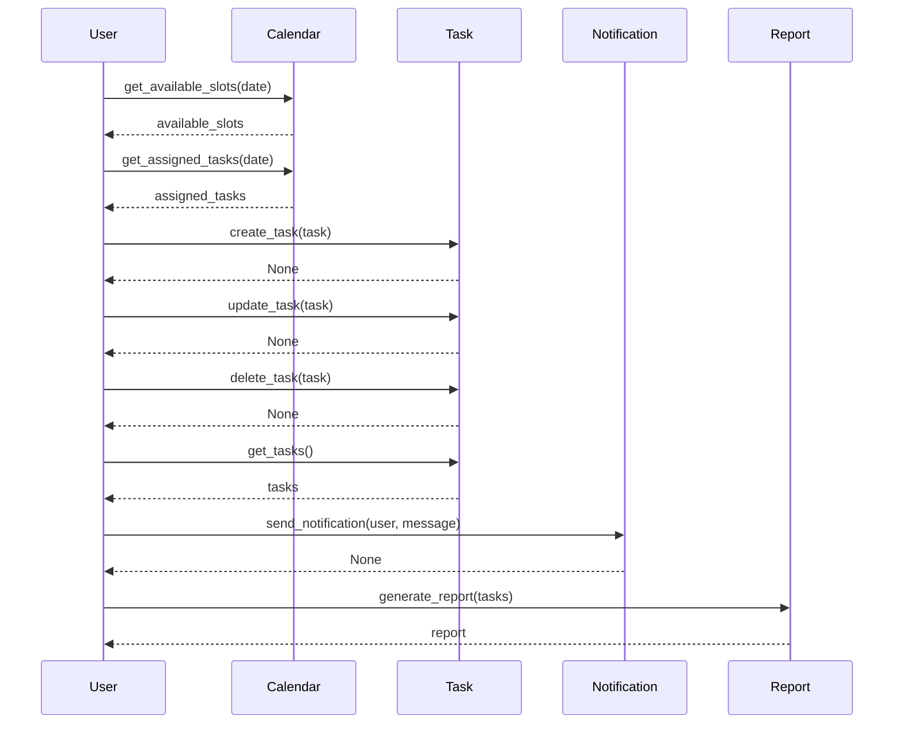

## Implementation approach:
For the calendar-based scheduling system, we can leverage the Django web framework to build a user-friendly and efficient application. Django provides a robust set of tools and features for handling web requests, managing databases, and rendering templates. It follows the Model-View-Controller (MVC) architectural pattern, which helps in organizing the codebase and separating concerns.

To handle the calendar functionality, we can use the FullCalendar library, which is a popular open-source JavaScript library for displaying and interacting with calendars. It provides a customizable and responsive calendar view that can be easily integrated with Django.

For notifications and reminders, we can use the Django Signals framework to send email notifications to users for upcoming tasks or appointments. Django Signals allow us to define certain actions to be triggered when specific events occur, such as creating or updating a task.

To generate reports or summaries of scheduled tasks and appointments, we can use the Django REST framework to create an API endpoint that can be accessed to fetch the required data. We can then use a data visualization library like Plotly or Matplotlib to generate the reports in various formats such as PDF or HTML.

## Python package name:
```python
"calendar_scheduler"
```

## File list:
```python
[
    "main.py",
    "models.py",
    "views.py",
    "urls.py",
    "templates/",
    "static/",
    "api.py",
    "utils.py",
    "tests.py"
]
```

## Data structures and interface definitions:


## Program call flow:


## Anything UNCLEAR:
The requirement is clear to me.